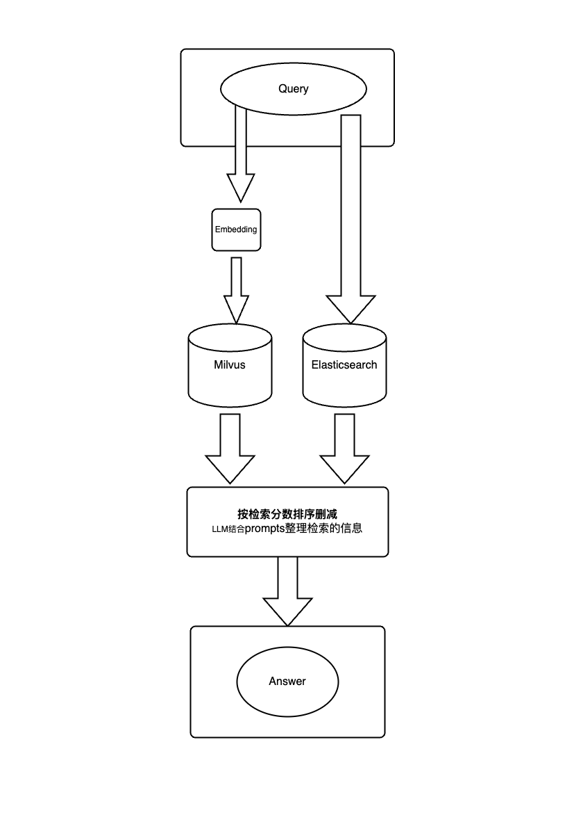

# Inverted Index and RAG AI 应用系统

## 项目测试预览

安装依赖
```bash

pip install -r requirements.txt
```
测试回答
```bash
python scripts/run_project.py answer --q 学校有多少个食堂 --baseid 知识库id
```
测试文本召回
```bash
python scripts/run_project.py retriever --q 学校有多少个食堂 --baseid 知识库id
```
测试创建知识库
```bash
python scripts/run_project.py create --basename 知识库名字
```

## 当前的混合式检索的思路



1. 传统 RAG 向量检索
2. Elasticsearch 启用模糊匹配检索

将得到的两个结果合并，然后根据匹配得分进行排序。

## OCR 将非文本类文档存入 Milvus 和 Elasticsearch

选用一个开源的 OCR 模型识别文档，利用 Langchain 的文本分割，将文本拆分成段。

对于 Milvus 数据库，先将文本向量化后，再将向量化的数据和文本内容存入数据库。

对于 Elasticsearch，直接将拆分的文本存入数据库。

## 混合式检索的知识库问答系统

### 功能

- 知识库上传
- 文档解析
  - 传统文档解析
  - 非文本文档进行 OCR 解析
- 知识库检索
  - 向量匹配
  - Elasticsearch 模糊查询
- 对话
  - Prompt 优化
  - 多轮对话
  - 指代替换
- 提供一系列API请求对话
- 有一个可视化后台提供知识库的上传、编辑等操作

### 实现效果

- 知识库创建
- 知识库文档添加、删除
- 对话问答
- 对话管理
  - 对话删除
  - 对话重命名
  - 对话新增

### 目前项目结构

```bash
/
├── .gitignore
├── README.md
├── app
│   ├── __init__.py
│   ├── api
│   ├── core
│   │   ├── __init__.py
│   │   ├── database
│   │   ├── llm
│   │   │   ├── __init__.py
│   │   │   ├── doubao.py
│   │   │   ├── llm.py
│   │   │   ├── llm_manager.py
│   │   │   └── openaillm.py
│   │   ├── ocr
│   │   │   ├── ocr_model.py
│   │   │   └── ocr_type.py
│   │   └── rag
│   │       ├── database
│   │       │   ├── __init__.py
│   │       │   ├── elasticsearch
│   │       │   │   └── elastic_client.py
│   │       │   ├── milvus
│   │       │   │   └── milvus_client.py
│   │       │   └── mysql
│   │       │       ├── model.py
│   │       │       └── mysql_client.py
│   │       ├── embedding
│   │       │   ├── __init__.py
│   │       │   ├── doubao_embedding.py
│   │       │   ├── embedding.py
│   │       │   ├── embedding_manager.py
│   │       │   └── openai_embedding.py
│   │       ├── rag_pipeline.py
│   │       ├── splitter
│   │       │   ├── __init__.py
│   │       │   ├── pdfsplitter.py
│   │       │   └── structured_file.py
│   │       └── utils
│   │           ├── __init__.py
│   │           ├── source_document.py
│   │           └── split_file.py
│   ├── main.py
│   ├── models
│   └── utils
├── config
│   ├── .gitignore
│   ├── __init__.py
│   ├── config.py
│   └── splitter_model.py
├── docs
├── main.py
├── requirement.txt
├── scripts
│   ├── __init__.py
│   ├── file.py
│   └── run_project.py
└── test
```

## 关于文本分割

1. 让大模型分割文本块（在每个块上加入特定字符用于系统分割处理）。大模型能更好地理解上下文关系，能够给出精确的文本分割，但对大模型能力要求高
   1. LLM拆分时，为了解决token的限制，采用滑动窗口式对文档进行拆分，不至于丢失过多的信息。比如文档长度为4000，则滑动窗口设置为1000，每次拆分时向前滑动800长度拆分。
2. 对于非文本类文本数据，如 PDF（图片式的 PDF）、图片的拆分，用户根据具体的内容设置拆分的块大小。
3. 而对于结构化的文本数据，如表格、Word、Markdown 等，利用 Langchain 文本分割器进行分割，即按段落、标题拆分。

实现文档拆分有预览效果，用户可选择使用大模型拆分、递归分割，还是 Markdown 这种结构分割。

目前多设计思路：
如果不采取大模型拆分，用句子拆分时，特别是OCR获取的文本，为确保检索质量，采取上下文窗口进行文本召回。
也就是可以让用户根据自己导入的文档内容结构决定使用什么拆分模式，如果可以接受使用大模型拆分则使用大模型拆分，并使用大模型拆分；也可选择使用递归拆分，通常文档是已经清洗好的成段的文本；当文档是图片时可以采用OCR识别文本，然后拆分成句子，并设置上下文窗口。文本召回时根据用户拆分时的类型选择召回方式，也就是是否使用上下文窗口召回。

## 计划支持的文件类型

- Word
- TXT
- Markdown
- PDF
- JPG, PNG
- Excel
- PPT
- JSON

## 技术栈

- 前端框架
  - Vue
  - Element-Plus
- 后端框架
  - FastAPI
- 数据库
  - Milvus
  - Elasticsearch
- OCR 框架
  - 百度飞桨（PaddleOCR）
- LLM 开发框架
  - Langchain


## 其他设想

关于大模型 tokens 有上限，可以借鉴操作系统内存管理算法。将不常用的历史对话移出大模型历史对话，存储起来，在大模型里仅保留压缩后的一小部分内容和用于检索的条件信息。这样可以将留出来的 tokens 用于其他处理。当用户涉及历史对话内容时，再从大模型外将对应内容调入大模型进行处理。